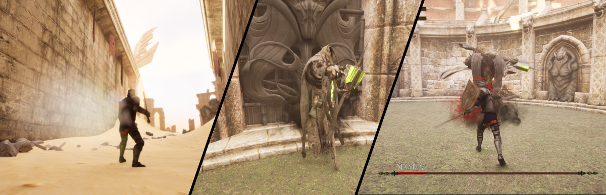

# UnrealBossBattle
A simple boss battle inspired by souls-like games. Made for fun to showcase and improve on my C++ and Unreal Engine skills. Made using C++ and minimal blueprints.

[Watch The YouTube Demo Video](https://youtu.be/9kaBWkGTkUc?si=pjO7ZW0UEAhsPSa9)

>**Engine Version:** Made in Unreal Engine 5.3.2

## Features
- Third Person Action RPG Character Movement
- Action System
  - Attacking
    - Three attack combo. Cancels if the attack button is not pressed again.
  - Sprinting
  - Healing
    - Unable to sprint
    - Consumes a healh potion
  - Rolling
    - Immunity granted during animation
  - Blocking
    - Immunity granted if facing attacker
  - Knockback
    - Applied when hit by a physical attack from the Boss
- Attribute System
  - Health
  - Stamina
    - Attacking, Sprinting, Rolling and Blocking all cost Stamina
    - Actions are unable to run until Stamina recovers
    - Blocking is cancelled if there is not enough Stamina
- AI
  - Boss AI with Behavior Trees
    - One basic combo attack
    - Two ultimate attacks with random selection and cooldown
    - Following and attack range detection
- UI
  - Health Bar
  - Stamina Bar
  - Health Potion Indicator
  - Main Menu
  - Game Over/Victory Screens
- Gamemode Logic
  - Cutscenes
  - Level Resetting and Game Flow
- Animation & Particle Effects
  - Time streching and editing
- Sound
  - Playing sound effects at specific timings
  - Background music and ambience

**Game Assets:** 
- Boss Model & Animations - Paragon Sevarog. Licensed for use with the Unreal Engine only.
- Player Knight Model & Animations - Adobe Mixamo
- Desert Arena Level - Infinity Blade: Temple. Licensed for use with the Unreal Engine only.
- Sound Effects - [Shapeforms Audio Free SFX](https://shapeforms.itch.io/shapeforms-audio-free-sfx)
- Music - [Free Fantasy RPG Music](https://alkakrab.itch.io/free-25-fantasy-rpg-game-tracks-no-copyright-vol-2)
- UI Potion Sprites - Hansjörg Malthane, http://opengameart.org/users/varkalandar
